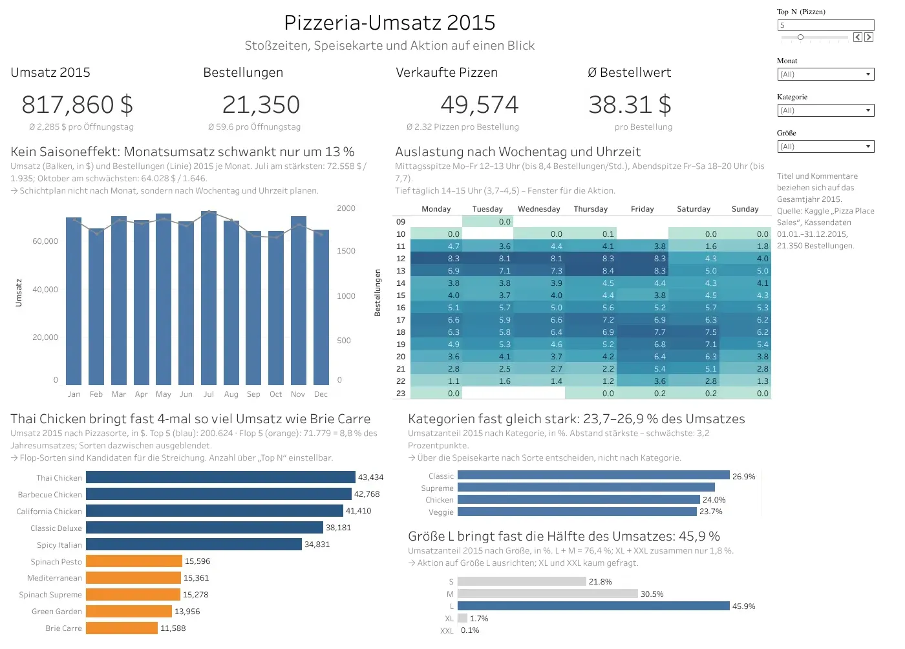

# 🍕 Umsatzanalyse einer Pizzeria

**817.860 $ Umsatz · 21.350 Bestellungen · Ø 38,31 $ pro Bestellung**

Analyse der Verkaufsdaten einer Pizzeria für das Jahr 2015 mit SQL und Tableau: Umsatz, Stoßzeiten, Bestseller und Empfehlungen zur Speisekarte.

## 1. Datenquelle

- Kaggle: [Pizza Place Sales](https://www.kaggle.com/datasets/mysarahmadbhat/pizza-place-sales)
- 4 Tabellen: `orders`, `order_details`, `pizzas`, `pizza_types`
- Zeitraum: 01.01.2015 – 31.12.2015

## 2. Werkzeuge

- **SQL**: SQLite (SQLite Online): JOIN, CTE, Fensterfunktionen, VIEW
- **Visualisierung**: Tableau Public
- **Versionierung**: GitHub

## 3. Fragestellungen & Ergebnisse

### Q0: Datenqualität
- 48.620 Bestellpositionen, keine fehlenden Werte
- Daten ohne Bereinigung nutzbar

### Q1: Kennzahlen 2015
- Umsatz **817.860 $**, 21.350 Bestellungen, 49.574 Pizzen
- Ø Bestellwert **38,31 $**, Ø 2,32 Pizzen pro Bestellung

### Q2: Entwicklung nach Monaten
- Stärkster Monat: Juli (72.558 $), schwächster: Oktober (64.028 $)
- Kein klarer Jahrestrend, Abstand 13,3 %

### Q3: Stoßzeiten
- Stärkster Tag: Freitag (70,8 Bestellungen/Tag), ruhigster: Sonntag (50,5)
- Spitzen 12–13 und 17–18 Uhr, ruhige Phase 14–15 Uhr

### Q4: Bestseller und Ladenhüter
- Umsatzstärkste Sorte: Thai Chicken (43.434 $), meistverkauft: Classic Deluxe (2.453 Stück)
- Schlusslicht in beiden Listen: Brie Carre (11.589 $, 490 Stück)

### Q5: Kategorien und Größen
- Kategorien fast gleich: 23,7 % bis 26,9 % des Umsatzes
- Größe L bringt 45,9 % des Umsatzes, XL und XXL zusammen nur 1,8 %

### Q6: Streichkandidaten
- 4 Sorten streichen: Brie Carre, Green Garden, Spinach Supreme, Mediterranean
- Betroffen: höchstens 6,87 % des Umsatzes (56.183 $)

### Q7: Große Bestellungen (4+ Pizzen)
- 18,2 % der Bestellungen bringen 39,4 % des Umsatzes
- Ø Bestellwert 83,14 $ statt 28,35 $ (2,9-mal höher)

### Q8: Aktion
- „Nachmittags-Deal" täglich 14–16 Uhr: Pizza L zum Preis von M
- Heute 13,7 % des Umsatzes in diesem Fenster; +10 % = +11.219 $ pro Jahr

## 4. Dashboard



🔗 [Interaktives Dashboard auf Tableau Public](LINK)

## 5. Projektstruktur

```
pizza-sales-analysis/
├── README.md              # Projektbeschreibung
├── data/                  # 4 Original-CSV von Kaggle
├── sql/
│   └── queries.sql        # alle Abfragen mit Kommentaren und Ergebnissen
├── exports/
│   └── sales_lines.csv    # Datenauszug für Tableau (VIEW sales_lines)
├── tableau/
│   └── pizza_dashboard.twbx
└── presentation/
    ├── presentation.pdf
    └── dashboard.png
```

## 6. Autor

**Sergii Vdovenkov**: [LinkedIn](LINK)
